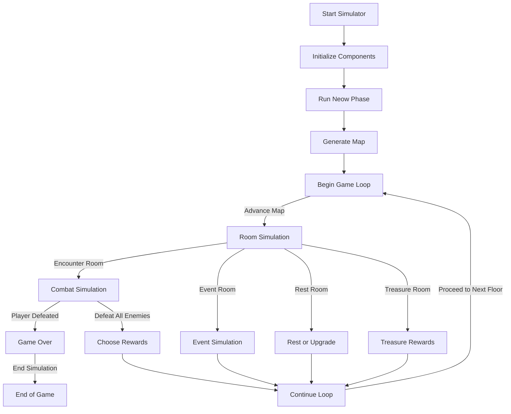
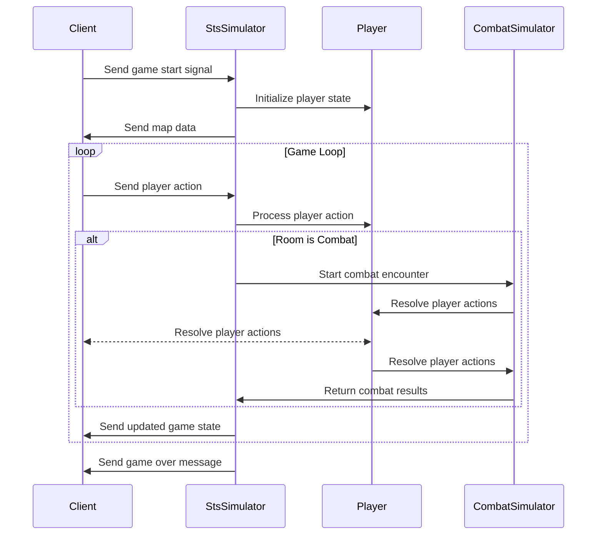

# High-Level Game Logic Diagram

This diagram provides an overview of the core flow and interactions within the Rust deck-building game.

## Sequence Diagram: Client Code Interaction

## Key Components:

1. **Start Simulator**: Initialize the simulator with seed, character, and communication channels.
2. **Initialize Components**: Set up RNGs, player state, and other required systems.
3. **Run Neow Phase**: Handle the initial Neow blessing and penalties.
4. **Generate Map**: Create a randomized map for navigation.
5. **Game Loop**: Iterate through floors and rooms until the game ends.
6. **Room Simulation**: Simulate various room types:
   - **Combat Simulation**: Run battles and resolve rewards.
   - **Event Simulation**: Handle special events.
   - **Rest Room**: Allow player to heal or upgrade.
   - **Treasure Room**: Grant treasure rewards.
7. **Choose Rewards**: Let the player choose rewards after combat.
8. **Game Over**: Handle the end of the game based on player health.

This structure ensures modularity and clarity, making the game logic extensible for additional features like new room types or mechanics.

---

## Implementation

The following sections provide the Rust implementation details for each component.